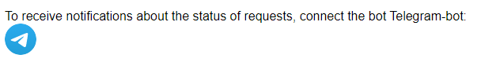

# Simple CRM project

Для начала работы необходимо выполнить установку необходимых для приложения пакетов:

```
pip install -r requirements.txt
```

Произвести миграции в базу данных:

```
manage.py migrate
```

Создать начальную систему групп и прав доступа:
```
manage.py create_groups_perms
```
Создадутся две группы: "Клиенты" и "Сотрудники". Каждая группа наделена разными правами доступа к функцианалу приложения. Клиенты вправе создавать запросы, просмтривать только свои запросы в личном кабинете, также менять ключевую информацию о себе. Сотрудники могут просматривать весь список запросов от пользователей, также просматривать/редактировать/удалять каждый запрос. При изменении статуса запроса сотрудником, Клиенту поступит уведомление через Телеграм бота (если Клиент подключил его в ЛК). Перевод конкретного пользователя в группу "Сотрудников" производится через административную панель.

Создание суперпользователя:
```
manage.py createsuperuser
```
Запуск сервера на локальной машине:
```
manage.py runserver
```

Необходимо запустить телеграм бота, который будет уведомлять о изменении статуса запроса:
```
manage.py runbot
```
Каждый пользователь может подключить телеграм бота для получения уведомлений об изменении статуса его запросов в личном кабинете, перейдя по ссылке:


